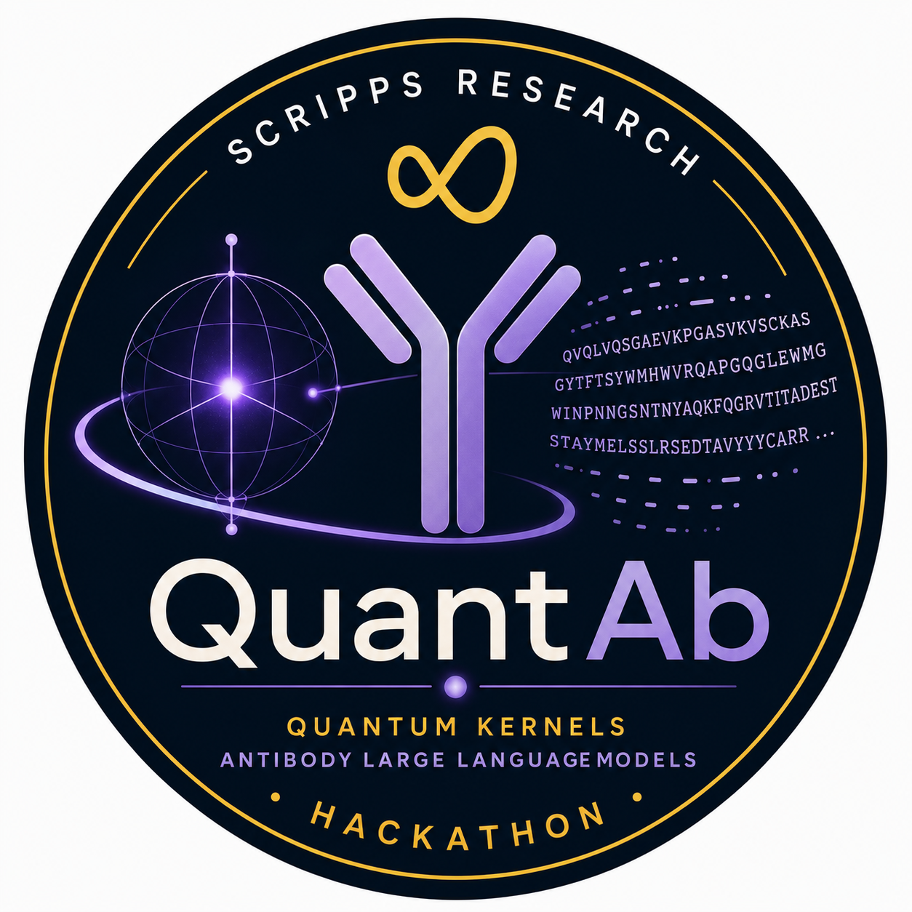

<p align="center">
  
</p>

# QuantAb

**Quantum kernel methods for antibody affinity prediction**

Can quantum kernels extract binding-relevant structure from antibody language model embeddings
that classical kernels miss — especially in the small-labeled-data regime typical of antibody
affinity prediction?

This project applies quantum machine learning to antibody-antigen affinity prediction. Antibody
sequences are encoded as embeddings via three language models — the antibody-specific
[IgBERT](https://huggingface.co/Exscientia/IgBert), the general protein model
[ESM-2](https://huggingface.co/facebook/esm2_t33_650M_UR50D), and the natively-paired
antibody model [BALM-paired](https://huggingface.co/brineylab/BALM-paired) (Burbach & Briney
2024) — then compressed to low dimensions via PCA, and evaluated using quantum kernel SVMs
versus classical baselines across a range of training set sizes (learning curves).

---

## Research question

> In the small-labeled-data regime characteristic of antibody affinity prediction, do quantum
> kernel methods operating on antibody language model embeddings capture binding-relevant
> structure that classical kernels miss?

A secondary question this project uniquely addresses:

> Does any quantum kernel advantage depend on the embedding model — antibody-specific (IgBERT),
> general protein (ESM-2), or natively-paired (BALM-paired)?

---

## Pipeline

```
Antibody sequences
      ↓
AbLM embeddings
  ├── IgBERT        (antibody-specific,  1024-dim, [CLS] pooling)
  ├── ESM-2 650M    (general protein,   1280-dim,  mean pooling)
  └── BALM-paired   (natively-paired,   1024-dim, [CLS] pooling)
      ↓
PCA reduction  →  6 or 10 dimensions  (= qubit count)
      ↓
┌──────────────────────────┐    ┌─────────────────────────────────┐
│  Quantum kernel SVM      │    │  Classical kernel SVM / RF      │
│  · Minimal ansatz        │    │  · Linear SVM                   │
│  · Expressive ansatz     │    │  · RBF SVM                      │
│    (PennyLane circuits)  │    │  · Polynomial SVM               │
└──────────────────────────┘    │  · Random Forest                │
                                └─────────────────────────────────┘
      ↓
Spearman ρ  vs.  training set size  →  learning curves
```

---

## Datasets

All experiments use publicly available deep mutational scanning (DMS) datasets with
continuous binding measurements (KD or enrichment score):

| Dataset | Antibody | Variants | Measurement |
|---|---|---|---|
| Phillips et al. 2021 | CR9114 anti-influenza (H1/H3) | ~67,000 | -log(KD) |
| Engelhart et al. | AAYL antibody variants | ~42,000 | Binding score |
| Shanehsazzadeh et al. | Trastuzumab (HER2) | 422 | -log(KD) |

---

## Installation

```bash
git clone git@github.com:mahdishafiei/QuantAb.git
cd QuantAb
pip install -r requirements.txt
pip install -e .
```

> **Note:** `torch` is installed as a CPU build by default. For GPU acceleration,
> install the appropriate CUDA version first:
> `pip install torch --index-url https://download.pytorch.org/whl/cu118`

Verify the install:

```bash
python -c "import quantab; print('quantab ready')"
```

---

## Running the pipeline

### Step 1 — Extract embeddings

Run IgBERT and ESM-2 on all datasets and save embeddings to disk.
This is the slow step (~30 min on CPU for 109k sequences). It only needs to run once —
subsequent runs skip already-computed files.

```bash
python scripts/extract_embeddings.py --data-dir /path/to/DMS_Data
```

Options:
```
--data-dir      Path to the DMS_Data directory (required)
--output-dir    Where to save embeddings (default: embeddings/)
--model         igbert | esm2_35M | esm2_150M | esm2_650M | balm_paired | all  (default: all)
--n-components  PCA dimensions to compute, e.g. --n-components 6 10  (default: 6 10)
--overwrite     Force recompute even if files exist
```

Output structure:
```
embeddings/
  igbert/
    phillips_all_raw.npy      # raw 1024-dim  (N, 1024)
    phillips_all_6d.npy       # PCA-reduced   (N, 6)
    phillips_all_10d.npy      # PCA-reduced   (N, 10)
    phillips_all_labels.npy   # affinity y    (N,)
    engelhart_...npy
    ...
  esm2_650M/
    phillips_all_raw.npy      # raw 1280-dim
    ...
  balm_paired/
    phillips_all_raw.npy      # raw 1024-dim  (paired heavy+light)
    ...
```

### Step 2 — Run experiments

Compute learning curves for all methods (quantum + classical) on the extracted embeddings.

```bash
python scripts/run_experiments.py
```

Options:
```
--embeddings-dir   Directory with embedding files (default: embeddings/)
--results-dir      Where to save results (default: results/)
--model            igbert | esm2_35M | esm2_150M | esm2_650M | balm_paired | all  (default: all)
--dataset          Specific dataset name(s) to run
--n-components     PCA dims to evaluate, e.g. --n-components 6 10
--no-quantum       Skip quantum kernels (much faster, classical only)
--overwrite        Rerun even if result files exist
```

For a quick test run (classical only, small dataset):
```bash
python scripts/run_experiments.py \
    --model esm2_650M \
    --dataset trastuzumab_zero_shot \
    --n-components 6 \
    --no-quantum
```

### Step 3 — Generate figures

```bash
python scripts/generate_figures.py
```

Saves one learning curve figure per result file to `figures/`.

---

## Programmatic API

```python
from pathlib import Path
from quantab import load_all, summarize, load_model, embed_and_reduce

# Load datasets
DATA_DIR = Path("/path/to/DMS_Data")
df = load_all(DATA_DIR)
summarize(df)

# Extract embeddings
tok, model, cfg = load_model("igbert")   # or "esm2_650M", "balm_paired"
X, y, pca = embed_and_reduce(
    df, tok, model, cfg,
    n_components=10,
    cache_path=Path("embeddings/igbert/all_10d.npy"),
)

# Run learning curve
from quantab import learning_curve, CLASSICAL_MODELS, build_minimal_kernel

# Classical
results = learning_curve(
    CLASSICAL_MODELS["rbf_svm"](),
    X, y,
    train_sizes=[20, 50, 100, 200, 500],
)

# Quantum
results = learning_curve(
    build_minimal_kernel(n_qubits=10),
    X, y,
    train_sizes=[20, 50, 100, 200],
    is_quantum=True,
)

# Plot
from quantab import plot_learning_curves
plot_learning_curves({"rbf_svm": results}, title="RBF SVM learning curve")
```

---

## Repository structure

```
QuantAb/
├── quantab/               # Core Python package
│   ├── __init__.py        # Clean public API
│   ├── data.py            # DMS dataset loaders
│   ├── embeddings.py      # IgBERT, ESM-2, BALM-paired extraction, PCA, model registry
│   ├── quantum_kernels.py # PennyLane quantum kernel implementations
│   ├── classical.py       # sklearn classical baselines
│   ├── evaluation.py      # Learning curves, CV, Spearman metric
│   └── visualization.py   # Figure generation
├── scripts/
│   ├── extract_embeddings.py   # Step 1: sequences → cached embeddings
│   ├── run_experiments.py      # Step 2: embeddings → learning curve results
│   └── generate_figures.py    # Step 3: results → figures
├── notebooks/             # Exploration notebooks
├── figures/               # Generated figures (committed)
├── requirements.txt
├── pyproject.toml
├── PLAN.md                # Full experimental design
├── CLAUDE.md              # Claude Code collaboration guide
└── MEMORY.md              # Design decisions and discussion log
```

---

## References

- Leem J. et al. (2022). IgBERT: antibody language model. *Bioinformatics*.
- Lin Z. et al. (2023). Evolutionary-scale prediction of atomic level protein structure with a language model. *Science* **379**, 1123–1130.
- Burbach S.M. & Briney B. (2024). Improving antibody language models with native pairing. *Patterns*. https://doi.org/10.1016/j.patter.2024.100967
- Phillips A.M. et al. (2021). Binding affinity landscapes constrain the evolution of broadly neutralizing anti-influenza antibodies. *eLife*.

---

## Team

Briney Lab, Department of Immunology and Microbiology, The Scripps Research Institute

---

## License

TBD
